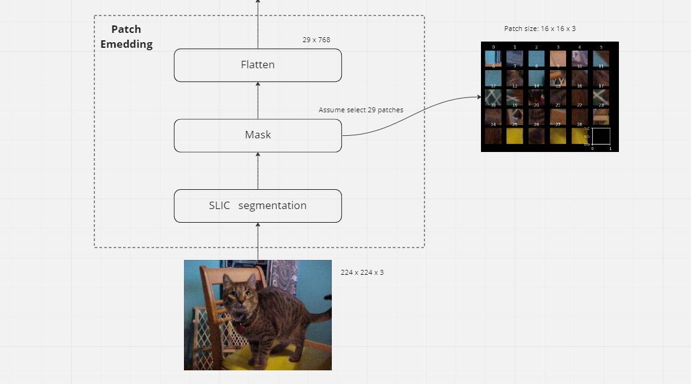

# Summer Project - 2022

This respority is to show my summer project of 2022. 
Our idea is to combine the SLIC algorithm with the Vision Transformer to improve the performance of the Vision Transformer. 

## Schematic diagram



The full vision schematic diagram is in [miro](https://miro.com/welcomeonboard/RmhDZGhsYnZZVGhNVzB5cGJwYXZxN2k4cVc1RWJ6Z3lPTXU0ZlBhTmtDSGJUNnpVa0lORk9jMGdqZWFRZnMxZXwzNDU4NzY0NTMyMDI2OTgyMTY2fDI=?share_link_id=744521960709).

## Requirements
- opencv
- numpy
- pytorch >=0.4.0
- torchvision
- skimage
- matplotlib

## Demo
We create a [demo](demo.ipynb) to show how SLIC algorithm works and how to use our work.

## Usage
Run  [slic_main.py](slic_main.py) to get the result of SLIC algorithm.

In the main function, there are some parameters that can be changed.
```
slic(path, numSegments=100, ratio=0.9, size=16, save_choice=False)

path                   the path of the image
numSegments            the number of segments
ratio                  the ratio of the mask
size                   the size of the patches (if you want a 16*16 patch, size=16)
save_choice            whether to save the result (default is False, and the result will be saved to the folder 'patches' with .jgp format)
```


## Dataset
More details about dataset can be found in the [README-dataset](README-dataset.md) file.

## Some points that remain unmet
- Combine the SLIC algorithm with the Vision Transformer
- SLIC (skimage vision) does not support the GPU
